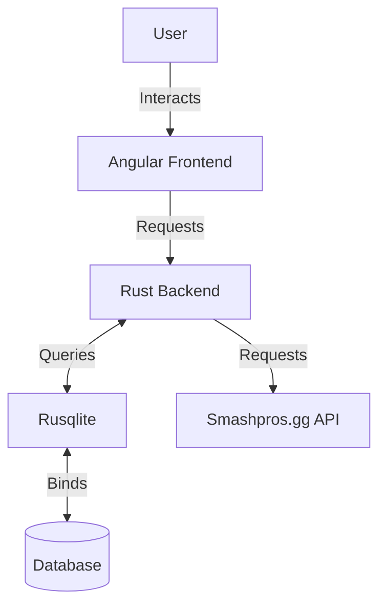
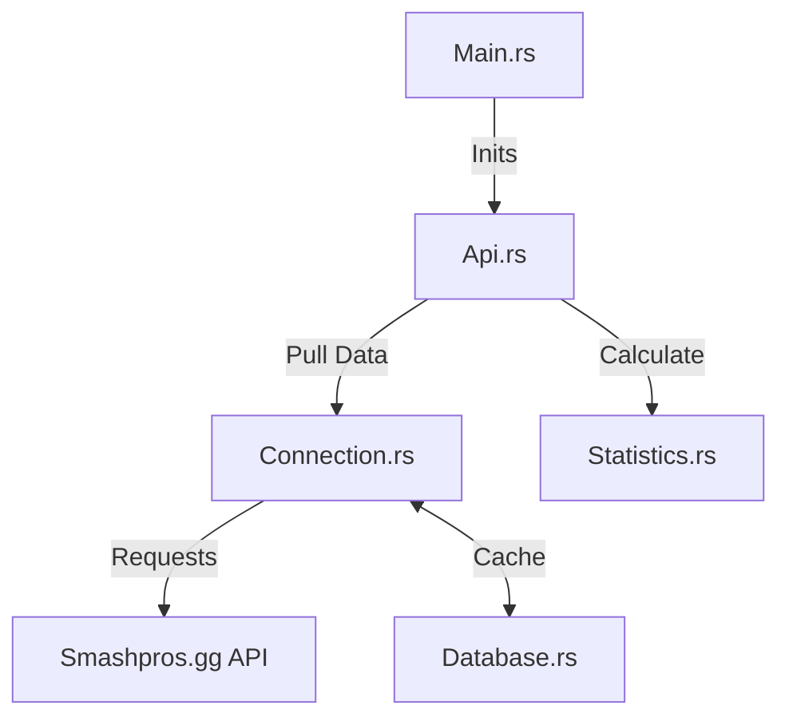

# Summary
A new matchmaking website came out recently for smash bros ultimate and its great. There really wasn't a good way to find games against good players besides going into discords and asking people if they wanna play. Smashpros.gg solved that problem but since they are in early state of development they don't have much when it comes to statistics about your games. They store raw data but they don't derive any interesting info from it and they don't show it to you. The goal for this project is to create the de facto standard statistics website for smashpros.gg.

# Methodology
The way I currently see this project working out is something similar to this flowchart.

The Rust backend will probably work similar to this.

